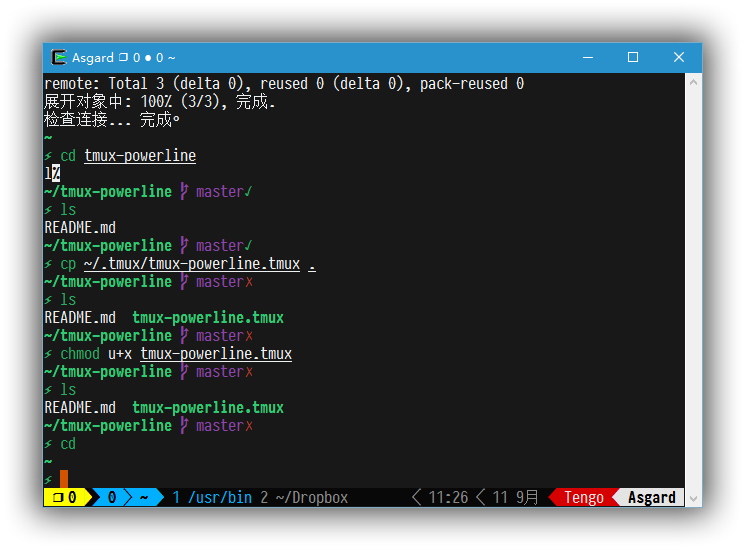

# tmux-powerline

A tmux theme based on powerline.

## Screenshot

## Install (with [Tmux Plugin Manager](https://github.com/tmux-plugins/tpm))

Add plugin to the list of TPM plugins in `.tmux.conf`:

    set -g @plugin 'gujiaxi/tmux-powerline'

Hit `prefix+I` to fetch the plugin and source it. Then, your tmux should be powerlined.
